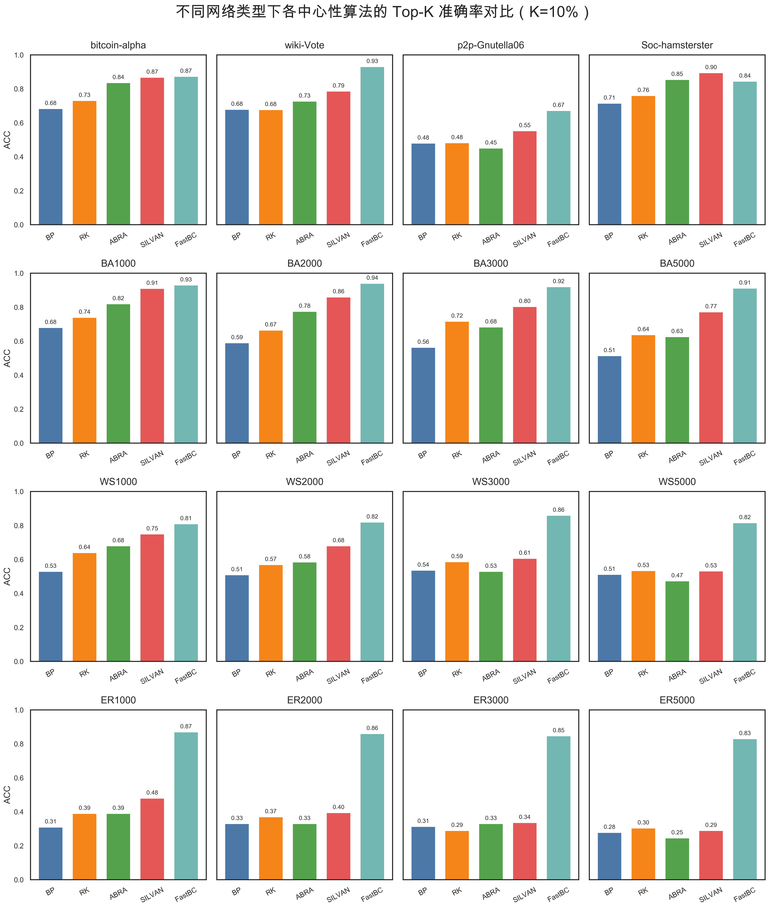
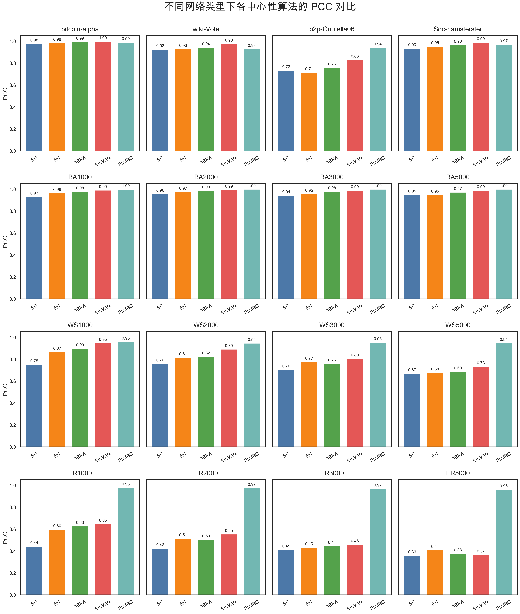
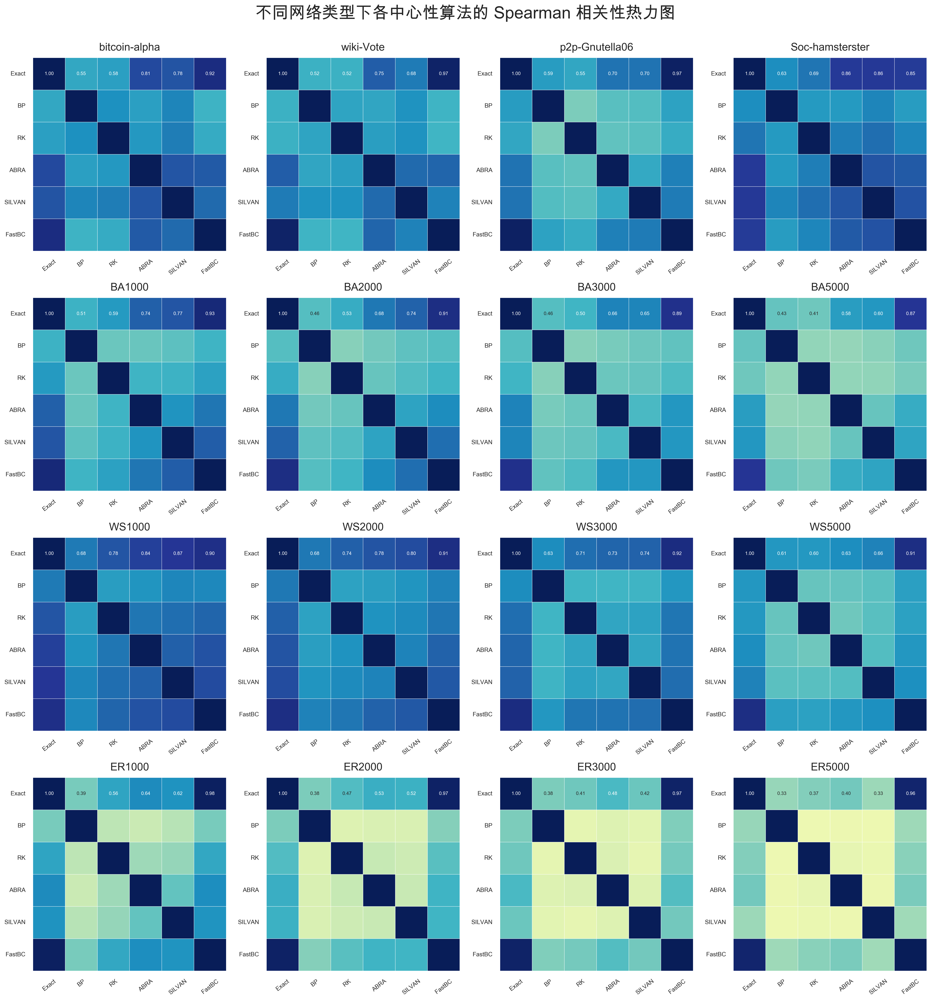
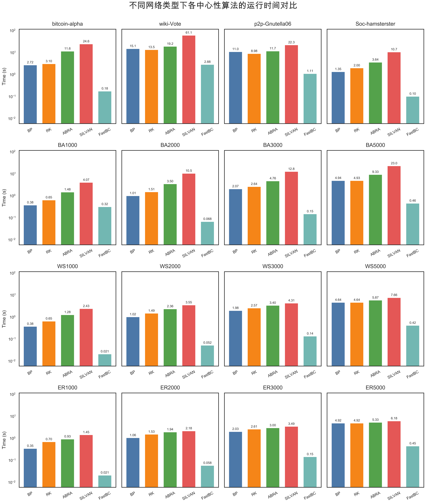

# 技术交底书

## 一、名称

复杂网络传播桥梁中心性计算方法

说明：上述名称为申请技术的通用名称，未使用商标、型号、人名或地名，且不超过 25 字。

---

## 二、所属技术领域

本发明属于复杂网络分析、传播动力学建模、节点重要性评估以及并行计算技术领域，具体涉及一种面向流行病传播、信息扩散、风险扩散、舆情传播和网络级联影响分析等场景的复杂网络节点传播桥梁中心性计算方法及系统。

本发明将复杂网络中的节点重要性从传统“最短路径中介作用”扩展为“传播过程中对后续扩散的直接和间接贡献”，并通过批量并行传播计算和反向贡献归因得到节点传播桥梁中心性分数。

---

## 三、背景技术

复杂网络中的节点中心性分析用于识别网络中的关键节点。现有技术中，常用的桥梁中心性或介数中心性方法主要基于最短路径思想，即统计某一节点位于多少条源节点到目标节点的最短路径上。典型方法包括：

1. 精确最短路径桥梁中心性计算方法，例如基于 Brandes 思想的精确介数中心性计算；
2. 随机源点对采样方法，通过抽取若干节点对及其最短路径估计节点重要性；
3. 自适应采样方法或分层采样方法，通过控制采样规模提高近似精度；
4. 面向大规模图的加速实现，包括并行 BFS、GPU 图遍历或近似路径采样等。

在本申请对应实现中，`exact_bc` 可作为精确最短路径桥梁中心性的对照基准，`BP_sampling_bc`、`RK`、`ABRA` 和 `SILVAN.run_fast()` 属于路径采样型或路径搜索型对照方法。

上述现有技术适合刻画节点在最短路径结构中的中介作用。但在流行病传播、信息扩散、风险扩散等实际场景中，传播往往不是沿唯一或少数最短路径发生，而是在多个邻居、多个时间步和多个传播源之间并行展开。此时，节点的重要性不仅取决于其是否处于最短路径上，还取决于其在传播状态演化中对后续扩散产生的贡献。

因此，现有基于最短路径统计的中心性方法难以充分描述一对多、多源、多时间步传播过程中的动态桥梁作用。同时，传统路径搜索型方法通常需要大量源节点遍历、路径枚举或路径采样，计算过程难以组织为规则的批量张量计算流程，限制了并行硬件的利用效率。

---

## 四、现有技术的缺点是什么？针对这些缺点，说明本发明要解决的技术问题

### 4.1 现有技术的主要缺点

现有路径搜索型或路径采样型中心性计算方法至少存在以下不足：

1. **传播机理表达不足**  
   传统最短路径桥梁中心性主要刻画节点位于最短路径上的次数，不能直接描述节点在流行病传播、信息扩散或风险扩散过程中的状态变化和后续传播贡献。

2. **难以适应一对多传播场景**  
   实际传播过程通常由一个或多个源节点向多个邻居扩散，并在多个时间步持续演化。最短路径方法更偏向静态路径结构统计，难以反映多源、多时间步传播中的动态桥梁作用。

3. **计算开销较大**  
   精确中心性计算需要从大量源节点出发执行图遍历，近似方法也需要大量路径采样或自适应采样，随着节点数和边数增加，运行时间增长明显。

4. **计算流程不够规整**  
   路径搜索和采样过程依赖不规则邻接访问、路径回溯和分支判断，难以充分利用 GPU 等并行硬件的批量张量计算能力。

5. **低重要性节点容易出现大量并列估计值**  
   部分采样方法在全节点排序时会产生大量零值或重复值，导致全节点 Spearman 排名相关性下降，不利于稳定刻画全局节点排序。

### 4.2 本发明要解决的技术问题

针对上述缺点，本发明拟解决以下技术问题：

1. 提供一种区别于最短路径计数的传播动力学桥梁中心性定义，用于刻画节点在传播过程中的桥梁作用；
2. 提供一种基于平均场 SIR 传播模型的节点状态演化计算方法，使节点重要性能够反映传播扩散过程；
3. 提供一种可批量处理多个传播源的并行计算机制，减少逐源循环和重复邻居遍历；
4. 提供一种正向传播与反向贡献归因结合的计算流程，能够量化节点对后续传播的直接和间接贡献；
5. 提供一种便于 GPU 或其他并行张量后端执行的实现方式，提高复杂网络节点重要性分析的运行效率；
6. 提供一套统一实验评估流程，用于与精确最短路径桥梁中心性及路径采样近似方法进行对比。

---

## 五、发明内容

本发明提供一种复杂网络传播桥梁中心性计算方法及系统。其核心思想是：将复杂网络中的节点桥梁作用从“位于多少条最短路径上”转化为“在传播过程中对后续扩散产生多少直接或间接贡献”，并通过批量并行传播和反向归因计算得到各节点的中心性分数。

本发明的整体流程可参见图1至图4。实验对比结果可参见图5至图8。

### 5.1 该系统由哪几部分组成

本发明系统可以包括以下模块：

1. **图输入与预处理模块**  
   用于读取复杂网络图，获取节点集合、边集合和可选边权重，并将原始节点编号映射为连续编号。

2. **边列表张量构建模块**  
   用于将图结构转换为适于并行计算的边索引张量 `edge_index=[src,dst]`，并根据需要生成边权重张量 `edge_weight`。

3. **传播参数设置模块**  
   用于设置传播概率 `beta`、恢复概率 `gamma`、传播步数 `steps`、批大小 `batch_size`、数值稳定参数 `eps` 以及是否提前终止等参数。

4. **多源批量调度模块**  
   用于将一个或多个传播源节点组织为 batch 维度。若未指定源节点，则以全部节点作为传播源；若指定源节点，则仅对指定源节点集合进行传播分析。

5. **正向传播计算模块**  
   用于基于平均场 SIR 模型，在多个传播源上同时推进易感、感染、恢复状态的演化。

6. **传播历史缓存模块**  
   用于保存每个时间步的传播状态，包括 `S_hist`、`I_hist`、`R_hist` 和 `new_inf_hist`，为反向归因提供状态依据。

7. **反向贡献归因模块**  
   用于从传播末时刻向前回传贡献，计算节点对下游传播的直接和间接影响。

8. **中心性输出模块**  
   用于对各源节点、各时间步的贡献结果进行聚合，输出每个节点的传播桥梁中心性分数。

9. **实验评估与可视化模块**  
   用于与精确最短路径桥梁中心性、BP、RK、ABRA、SILVAN 等对照方法进行比较，并输出 Top-k Accuracy、PCC、Spearman 排名相关性和运行时间等指标。

### 5.2 每一部分的主要技术特征

#### 5.2.1 图输入与预处理模块

该模块读取复杂网络图 `G`，建立原始节点编号与内部连续编号之间的映射：

```text
node_map: 原始节点编号 -> 连续编号
rev_map: 连续编号 -> 原始节点编号
```

采用连续编号后，可以将节点状态组织为矩阵或张量，便于后续批量计算。对无向图，可同时加入正向边和反向边，使传播计算覆盖双向邻接关系。

#### 5.2.2 边列表张量构建模块

该模块将图结构转换为边索引：

```text
edge_index = [src, dst]
```

其中 `src` 表示边的源节点编号，`dst` 表示边的目标节点编号。若图中存在边权重，则构造 `edge_weight`，并将其与传播参数相结合形成边级传播概率：

```text
beta_e = beta * edge_weight
```

若不存在边权重，则所有边共享统一传播概率 `beta`。

#### 5.2.3 多源批量调度模块

该模块将多个传播源节点组织为 batch 输入。对于一个批次中的源节点集合：

```text
source_nodes = [s1, s2, ..., sb]
```

系统为每个源节点建立一组独立的 S/I/R 状态。这样，多个源节点的传播过程可以在同一张量中同时推进，从而降低逐源循环开销。

#### 5.2.4 正向传播计算模块

本发明采用平均场 SIR 传播模型。对节点 \(j\) 在时刻 \(t\) 的传播状态，定义：

\[
q_j(t)=\prod_{i \in N(j)} \left(1-\beta_{ij}I_i(t)\right)
\]

\[
S_j(t+1)=S_j(t)q_j(t)
\]

\[
I_j(t+1)=(1-\gamma)I_j(t)+S_j(t)(1-q_j(t))
\]

\[
R_j(t+1)=R_j(t)+\gamma I_j(t)
\]

其中，\(S_j(t)\)、\(I_j(t)\)、\(R_j(t)\) 分别表示节点 \(j\) 在时刻 \(t\) 处于易感、感染、恢复状态的概率或强度，\(\beta_{ij}\) 表示边级传播参数，\(\gamma\) 表示恢复参数。

在实现中，为提升数值稳定性和并行计算效率，本发明将感染失败概率的乘积转换为对数空间求和：

\[
\log q_j(t)=\sum_i \log(1-\beta_{ij}I_i(t))
\]

具体计算过程为：

```text
I_src = I[:, src]
prob = clamp(1 - beta_e * I_src, eps, 1.0)
msg = log(prob)
log_q = scatter_add(msg, dst)
q = exp(log_q)
new_inf = S * (1 - q)
S_new = S * q
I_new = (1 - gamma) * I + new_inf
R_new = R + gamma * I
```

其中，`scatter_add` 用于将边级消息按目标节点聚合为节点级状态更新量。

#### 5.2.5 传播历史缓存模块

正向传播过程中，系统保存每个时间步的状态：

```text
S_hist[t]
I_hist[t]
R_hist[t]
new_inf_hist[t]
```

这些历史状态不仅用于分析传播过程，也作为反向贡献归因的输入。

#### 5.2.6 反向贡献归因模块

在正向传播完成后，本发明从末时刻向前执行贡献归因。对每一时刻 \(t\)，先计算边级贡献比例：

```text
numerator = I_hist[t][:, src] * beta_e
denom = scatter_add(numerator, dst) + eps
delta = numerator / denom[:, dst]
```

其中，`delta` 表示某条边在目标节点传播输入中的相对贡献比例。

随后计算下游传播贡献：

```text
downstream = (delta + C[t+1][:, dst]) * I_hist[t+1][:, dst]
```

再按源节点回聚贡献：

```text
C[t] = scatter_add(delta * downstream, src)
```

通过上述反向过程，节点不仅获得其即时传播贡献，还获得其经由下游节点继续传播所形成的间接贡献。

#### 5.2.7 中心性输出模块

本发明对每个源节点的传播贡献按时间维度聚合：

```text
score_per_source = (I_hist[:T+1] * C[:T+1]).sum(dim=0)
```

然后对全部源节点结果取平均，并使用 `rev_map` 将内部连续编号恢复为原始节点编号，最终输出：

```text
{node: score}
```

该分数即为本发明定义的节点传播桥梁中心性分数。

### 5.3 各部分的连接关系

本发明各模块之间的连接关系如下：

1. 图输入与预处理模块接收原始复杂网络图，并输出节点映射；
2. 边列表张量构建模块基于节点映射生成 `edge_index` 和可选 `edge_weight`；
3. 传播参数设置模块向正向传播计算模块和反向贡献归因模块提供 `beta`、`gamma`、`steps`、`eps` 等参数；
4. 多源批量调度模块生成批量源节点集合，并将其输入正向传播计算模块；
5. 正向传播计算模块基于 `edge_index`、边级传播参数和源节点 batch 执行 SIR 状态更新；
6. 传播历史缓存模块保存正向传播过程中产生的历史状态；
7. 反向贡献归因模块读取传播历史，并沿时间反向计算节点贡献；
8. 中心性输出模块接收归因结果，生成节点传播桥梁中心性分数；
9. 实验评估与可视化模块读取中心性输出和对照方法输出，生成 CSV 结果和对比图。

### 5.4 该方法的操作过程

本发明方法的操作过程可概括为以下步骤：

1. 输入复杂网络图 `G`，以及传播概率、恢复概率、传播步数、批大小等参数；
2. 对图中节点进行连续编号映射，并构建 `edge_index` 和可选 `edge_weight`；
3. 选择传播源节点集合；若未指定，则以全部节点作为源节点；
4. 将传播源节点按 `batch_size` 分批；
5. 对每个 batch 初始化 S/I/R 状态；
6. 对每个时间步执行平均场 SIR 正向传播更新；
7. 在正向传播过程中保存每一时间步的传播历史状态；
8. 从末时刻向前执行反向贡献归因，计算边级贡献比例和节点级下游贡献；
9. 对源节点维度和时间维度上的贡献结果进行聚合；
10. 将内部编号转换回原始节点编号，输出节点传播桥梁中心性分数；
11. 可选地，与精确最短路径桥梁中心性及近似方法进行对照评估，输出 Top-k Accuracy、PCC、Spearman 和运行时间。

### 5.5 实验对比方案

为了说明本发明的技术效果，本实施例使用 `src/result_v1` 下的实验结果作为对比依据。实验网络包括 10 个真实网络和 13 个合成网络，合成网络包括 BA、WS、ER 三类结构。统一设置 Top-k 比例为 10%，对比方法包括 BP、RK、ABRA、SILVAN 以及本发明方法。实验结果文件包括：

```text
src/result_v1/acc.csv
src/result_v1/pcc.csv
src/result_v1/spearman.csv
src/result_v1/time.csv
```

实验对比图包括：

```text
src/result_v1/figures/acc_bar_grid_4x4.png
src/result_v1/figures/pcc_bar_grid_4x4.png
src/result_v1/figures/spearman_heatmap_grid_4x4.png
src/result_v1/figures/time_bar_grid_4x4.png
```

其中，实验图中显示的 `FastBC` 为本发明方法在实验可视化中的简称。

---

## 六、有益效果

与现有技术相比，本发明至少具有以下有益效果：

1. **能够刻画传播过程中的桥梁作用**  
   本发明不再仅以节点是否位于最短路径上作为重要性依据，而是基于 SIR 传播状态演化和后续传播贡献刻画节点桥梁作用，更适合流行病传播、信息扩散、风险扩散等一对多传播场景。

2. **计算流程更适合并行硬件执行**  
   本发明将传播过程组织为边级 gather、对数空间消息计算、`scatter_add` 聚合、批量状态更新和反向归因等规则张量操作，便于 GPU、MPS 或其他并行张量后端执行。

3. **支持多源批量计算**  
   多个传播源被组织为 batch 维度同时计算，减少了传统方法中逐源遍历、重复邻居访问和 Python 层循环开销。

4. **能够输出连续性更强的节点分数**  
   相比部分路径采样方法在低重要性节点上容易产生大量零值或并列估计值，本发明通过传播状态演化和贡献归因得到更连续的节点传播桥梁分数，有利于全节点排序分析。

5. **运行时间显著降低**  
   在 `result_v1` 所示 23 组网络实验中，本发明方法在全部网络上均取得最快运行时间，平均运行时间约为 0.404 秒。相较于 BP、RK、ABRA 和 SILVAN，本发明方法的中位加速比分别约为 14.4 倍、18.0 倍、33.2 倍和 67.9 倍。

6. **关键节点识别和相关性表现良好**  
   在相同实验中，本发明方法平均 Top-k Accuracy 为 0.831，平均 PCC 为 0.948，与 Exact 的平均 Spearman 排名相关系数为 0.893，说明本发明在显著加速的同时，能够保持较高的关键节点识别质量和排序一致性。

7. **便于工程集成和复现实验**  
   本发明可以输出节点中心性分数字典，也可输出统一评估指标和图形结果，便于在复杂网络分析系统中集成和复现。

需要说明的是，本发明定义的是传播动力学意义下的节点传播桥梁中心性，并非最短路径桥梁中心性的简单近似或 GPU 复现。上述实验指标用于说明本发明方法与传统方法之间的相关性、差异性和运行效率。

---

## 七、本发明的关键点和欲保护点是什么？

本发明的关键点和拟重点保护内容包括：

1. **传播桥梁中心性的定义思想**  
   将节点桥梁作用定义为节点在传播过程中对后续扩散产生的直接和间接贡献，而非传统最短路径经过次数。

2. **基于平均场 SIR 的批量传播计算方法**  
   使用 S/I/R 状态描述传播过程，并将多个传播源组织为 batch 维度同时推进传播。

3. **对数空间传播失败概率聚合机制**  
   将多个邻居感染失败概率的乘积转换为对数空间求和，再通过指数恢复，从而提升数值稳定性和并行计算效率。

4. **基于 `scatter_add` 的边级消息到节点级状态聚合机制**  
   通过边索引 `edge_index=[src,dst]` 和按目标节点聚合，实现传播消息的并行归约。

5. **传播历史缓存机制**  
   在正向传播过程中保存 `S_hist`、`I_hist`、`R_hist`、`new_inf_hist`，作为反向贡献归因的基础。

6. **正向传播与反向贡献归因闭环**  
   从末时刻向前回传传播贡献，计算边级贡献比例、下游传播贡献和节点级归因贡献。

7. **多源结果聚合与节点中心性输出方式**  
   对不同源节点、不同时间步的传播贡献进行聚合，并恢复为原始节点编号下的中心性分数。

8. **支持边权、批大小和不同计算设备的实现方式**  
   支持可选边权重、不同 batch size、CUDA、MPS 或 CPU 回退执行。

9. **用于对照评估的统一实验流程**  
   将本发明方法与精确最短路径桥梁中心性及多种近似方法在 Top-k Accuracy、PCC、Spearman 和运行时间上统一比较。

上述保护点既可以作为方法权利要求的基础，也可以扩展为系统、装置、电子设备和计算机可读存储介质等形式。

---

## 八、附图

### 图1 系统总体架构图

建议绘制内容：复杂网络输入、图预处理模块、边列表张量构建模块、多源批量调度模块、正向传播计算模块、传播历史缓存模块、反向贡献归因模块、中心性输出模块、实验评估与可视化模块。

```text
复杂网络图
   |
图预处理与节点映射
   |
边列表张量 edge_index / edge_weight
   |
多源 batch 调度
   |
平均场 SIR 正向传播
   |
传播历史缓存
   |
反向贡献归因
   |
节点传播桥梁中心性分数
   |
实验评估与可视化
```

### 图2 图预处理与节点映射流程图

建议绘制内容：原始节点编号、连续编号映射、反向映射、边索引构建、无向边反向补充、边权重处理。

```text
原始图 G
  -> 读取节点和边
  -> 建立 node_map / rev_map
  -> 生成 src / dst
  -> 生成 edge_index
  -> 可选生成 edge_weight
```

### 图3 多源 batch 化正向传播流程图

建议绘制内容：多个源节点进入 batch，初始化 S/I/R 状态，按时间步执行 SIR 状态更新。

```text
源节点集合
  -> 按 batch_size 分批
  -> 初始化 S/I/R
  -> t=0...T-1 传播更新
  -> 保存 S_hist / I_hist / R_hist / new_inf_hist
```

### 图4 反向贡献归因流程图

建议绘制内容：从末时刻向前计算 `delta`、`downstream` 和 `C[t]`，最终聚合得到节点中心性。

```text
传播历史状态
  -> 从 T-1 到 0 反向迭代
  -> 计算边级贡献比例 delta
  -> 计算下游贡献 downstream
  -> scatter_add 回传到源节点
  -> 聚合得到中心性分数
```

### 图5 Top-k Accuracy 对比结果图



### 图6 PCC 分数相关性对比结果图



### 图7 Spearman 排名相关性热力图



### 图8 运行时间对比结果图


